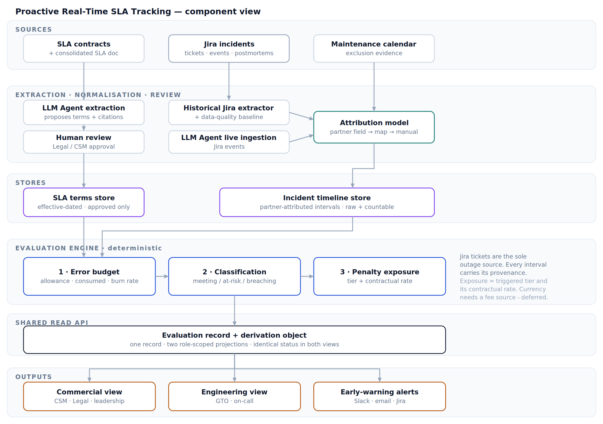

# Proactive Real-Time SLA Tracking

Track whether we're **meeting**, **at risk of missing**, or **breaching** each partner's SLA — using their
contract and our Jira incidents — and warn us **before** a breach happens, not after. Phase 1 covers our
11 most critical partners.

> Today we're largely reactive and blind on contractual SLAs. Each partner has different SLAs, often split
> across services and components, and we mostly find out how we're doing after the fact. This project adds an
> AI-assisted tracking layer on top of the consolidated SLA data that monitors performance per partner (and
> per service), flags where we're meeting / at risk / breaching, surfaces the penalty exposure, and gives
> early warning while there's still time to act.

## Architecture

Data flows in one direction, from raw sources to a single evaluated record that every view and alert reads
from — so the business and engineering pictures can never disagree.

1. **Sources** — three inputs feed the system:
   - **SLA contracts** (plus the consolidated SLA doc) — what we promised each partner.
   - **Jira incidents** (tickets, events, postmortems) — the *sole* source of outage time.
   - **Maintenance calendar** — evidence for windows that are excluded from the SLA.
2. **Extraction · normalisation · review**
   - An **LLM agent** reads each contract and *proposes* the SLA terms with citations.
   - A **human review** step (Legal / CSM) approves every drafted term before it is ever used.
   - A **historical Jira extractor** builds a data-quality baseline, while an **LLM agent live-ingests** new
     Jira events.
   - An **attribution model** maps each incident to the partner and service it affected (partner field →
     map → manual fallback).
3. **Stores**
   - **SLA terms store** — effective-dated, approved terms only.
   - **Incident timeline store** — partner-attributed outage intervals, kept both raw and countable.
4. **Evaluation engine (deterministic)** — one calculation, run the same way every time:
   1. **Error budget** — allowance, consumed, and burn rate.
   2. **Classification** — meeting / at-risk / breaching.
   3. **Penalty exposure** — the triggered tier and its contractual rate.
5. **Shared read API** — a single **evaluation record + derivation object**: one record, two role-scoped
   projections, identical status in both views, and every response stamped with when it was last updated.
6. **Outputs** — all read from that same record:
   - **Commercial view** (CSM · Legal · leadership)
   - **Engineering view** (GTO · on-call)
   - **Early-warning alerts** (Slack · email · Jira)

**Design notes**

- Jira tickets are the *sole* outage source, and every interval carries its provenance (how we know the
  timing and who was affected).
- Penalty exposure is expressed as the triggered tier and its contractual rate (e.g. "10% credit"). Showing
  an actual currency amount needs a fee source and is deferred for now — adding it later requires no rework.
- Classification is always **calculated**, never set by hand.

### Stage details

| Stage | What happens |
| --- | --- |
| Sources | Pull in partner contracts, Jira incidents, and the maintenance calendar |
| Reading & matching | An LLM agent drafts SLA terms from each contract; incidents are matched to the partner and service they affected |
| Human check | Legal or a CSM approves each AI-drafted term before it's used |
| Storage | Approved terms and matched outages are saved in one place the rest of the system reads from |
| Calculation | Work out downtime used, the status (OK / at risk / breaching), and what it could cost |
| Dashboards & alerts | The business view, the technical view, and automatic warnings all read from the same result |

## Data inputs

**From each Jira incident**

| Field | What it's for |
| --- | --- |
| Severity | Decides whether it counts as an SLA-affecting outage at all |
| Affected service | Which service was impacted |
| Affected merchant | Which partner(s) it hit |
| Outage minutes | How long it lasted — what we measure against the SLA |
| Status | Whether it's still open or resolved |

**From each contract**

| Field | What it's for |
| --- | --- |
| Uptime target | e.g. 99.9% |
| Measurement window | e.g. per calendar month |
| Exclusions | What doesn't count against us, e.g. planned maintenance |
| Penalty rate | e.g. "10% credit" if we miss |

## SLA status model

The evaluation engine turns raw outages into one clear status per partner-service, with a plain reason:

- **Meeting** — using the downtime budget at or below the expected pace.
- **At risk** — on track to run out of budget before the window closes.
- **Breaching** — the whole allowance is already used up.

The budget comes straight from the target. For example, a **99.9%** monthly target allows **43.2 minutes** of
downtime per month. If a partner has used 30 of those 43.2 minutes by the 10th, ~13 minutes remain and they're
trending to run out around the 14th — so they're flagged **at risk** with the reason "burning budget ~2× expected."

## Dashboards

Both views are built from the exact same evaluated numbers, so they never disagree — they just show a
different level of detail for different people. Access is enforced **server-side**, not by hiding fields in the UI.

**Business view** (CSM + Legal)

- Status — OK / At risk / Breached — in plain contract language.
- What we promised, and how much of the allowed downtime is left.
- The credit % at stake.
- Click any figure for a plain-English reason (which outages, what was excluded and why) — no ticket numbers,
  no technical internals, safe to show a partner.

**Technical view** (Engineering + on-call)

- The same statuses, plus the Jira tickets behind each one and the minutes attributed.
- How confident we are about the timing and who was affected.
- A health panel: is data flowing, is anything stale, is anything waiting on a human.
- Tools to fix a wrong match or re-run a calculation.

## Alerts

Automatic notifications while there's still time to act:

- Warn when a partner is burning budget too fast, escalate as it worsens, and notify on an actual breach.
- CSM alerts read in plain terms with the credit % at stake; engineer alerts carry the ticket detail.
- No spam — one alert per situation, and no alerts during excluded maintenance.
- Rules are back-tested against last year's data so we know they'd have fired a sensible number of times.

Example — Slack to the CSM: *"Partner A trending to miss 99.9% in ~6 days — 10% credit at risk,"* not forty
repeats of "availability degraded."

## Phase 1 partners

Scopely · Niantic · Kabam · Warner Brothers · Bandai Namco · Second Dinner · Roblox · Twitch · Mihoyo ·
Nexters · Netmarble

## Known unknowns

- **Where we keep proof of planned-maintenance windows** — not decided yet. Check first whether Jira's
  change-management fields already cover this before looking elsewhere.
- **Which severity levels count as an SLA-affecting outage**, and whether a partial outage counts as half or
  full — needs Legal + CSM agreement.
- **How much older incident history has clean start/fix times and named partners** — still being measured.
  This affects how far back we can trust the numbers, not whether the project works.
- **Whether we ever show a dollar amount** instead of just the contract rate — deferred; easy to add later.

## Roadmap

Tracked under [GTOC-30](https://xsolla.atlassian.net/browse/GTOC-30). No dates — work moves in dependency
order, so anything whose earlier step is done can start.

| Step | Tasks |
| --- | --- |
| Agree the rules | [GTOC-31](https://xsolla.atlassian.net/browse/GTOC-31) |
| Get the historic data ready | [GTOC-32](https://xsolla.atlassian.net/browse/GTOC-32) · [GTOC-33](https://xsolla.atlassian.net/browse/GTOC-33) · [GTOC-34](https://xsolla.atlassian.net/browse/GTOC-34) |
| Set up each partner's contract terms | [GTOC-35](https://xsolla.atlassian.net/browse/GTOC-35) · [GTOC-36](https://xsolla.atlassian.net/browse/GTOC-36) · [GTOC-37](https://xsolla.atlassian.net/browse/GTOC-37) · [GTOC-38](https://xsolla.atlassian.net/browse/GTOC-38) |
| Build the calculation engine | [GTOC-39](https://xsolla.atlassian.net/browse/GTOC-39) · [GTOC-40](https://xsolla.atlassian.net/browse/GTOC-40) · [GTOC-41](https://xsolla.atlassian.net/browse/GTOC-41) · [GTOC-42](https://xsolla.atlassian.net/browse/GTOC-42) |
| Build the dashboards | [GTOC-43](https://xsolla.atlassian.net/browse/GTOC-43) · [GTOC-44](https://xsolla.atlassian.net/browse/GTOC-44) · [GTOC-45](https://xsolla.atlassian.net/browse/GTOC-45) |
| Set up alerts | [GTOC-46](https://xsolla.atlassian.net/browse/GTOC-46) |
| Go live + hand over | [GTOC-47](https://xsolla.atlassian.net/browse/GTOC-47) · [GTOC-48](https://xsolla.atlassian.net/browse/GTOC-48) |

## References

- Architecture: [Proactive Real-Time SLA Tracking Architecture](https://xsolla.atlassian.net/wiki/spaces/PS4/pages/25126438361/Proactive+Real-Time+SLA+Tracking+Architecture) (Confluence, space PS4)
- Epic: [GTOC-30 — Proactive, Real-Time SLA Tracking](https://xsolla.atlassian.net/browse/GTOC-30)
